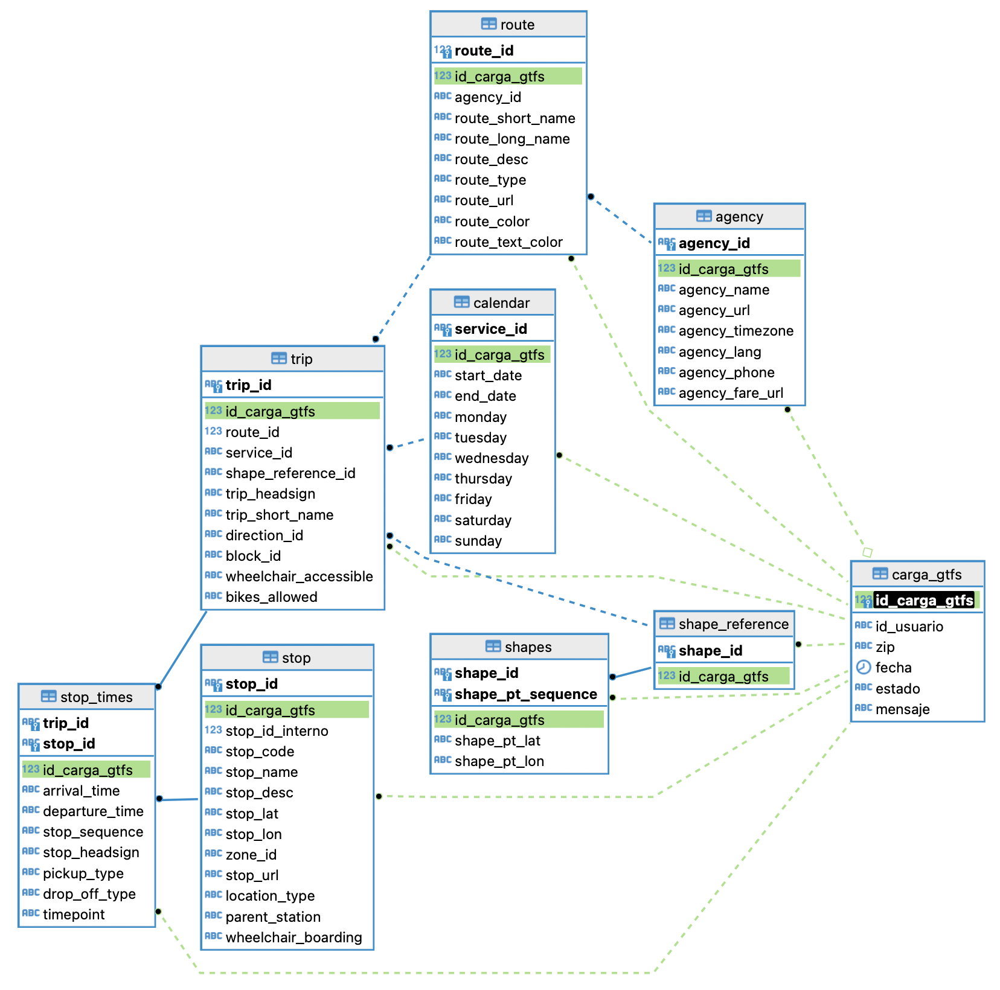

# FDE-Hike

- [Introduction](#introduction)
- [Pipeline](#pipeline)
  - [Processes](#processes)
- [How to Run?](#how-to-run)
  - [Automatic](#automatic)
  - [Manual](#manual)

## Introduction

The main objective of this project is to design and propose a solution for the automation of records management in static GTFS files. The goal is to facilitate the automatic identification of new and obsolete records. Although this project is based in the city of Concepción, Chile, it has been developed with an adaptable approach that allows its implementation in different cities, adapting to their specific needs.

The selected static GTFS model was the one recommended by the [Google Transit](https://developers.google.com/transit/gtfs/reference) team, one of the key issues was the lack of a GTFS data model specific to Concepción. This requires the creation of a data structure that adapts to the local characteristics and needs of the city's transportation system. The final model is as follows:



Within the framework of this design, we opted for the creation of two specific tables to address particular needs of the city of Concepcion:

1. The Load-gtfs table was created for data tracking.
The assignment of the primary key 'id-load-gtfs' as a foreign key in other tables fulfills a function of indicating which records were entered during a specific load.

2. In Concepción, unlike the model offered by Google Transit, the shape table has duplicated data, so we had to adapt it to our needs and we created a new table that stores the 'Shapes' data without duplicates, establishing relationships with the 'trips' table.

3. In the 'Stops' table, due to the variability found in the 'id-stops' field, which presented parts of a date and a code without a specific format. It is proposed to address this variability with the creation of an 'id-stops-intern of an 'id-stops-internal' that follows an incremental logic when entering new records in the database.

## Pipeline

Insert image :)

### Processes


## How to run

Run the Docker daemon, then...

## Automatic startup
### MacOS / Linux 
```sh
./start.sh
```

If you get a permission error, check the current permissions of the start.sh script
```sh
ls -l start.sh
```

If the script doesn't have execute permissions, you can add them using the chmod command
```sh
chmod +x start.sh
```

You should then be able to run the initial command.

## Manual Startup (all)


Now edit or create an **.env** file like so
```
AIRFLOW_UID=


_AIRFLOW_WWW_USER_USERNAME=airflow
_AIRFLOW_WWW_USER_PASSWORD=airflow
AIRFLOW_GID=0
_PIP_ADDITIONAL_REQUIREMENTS=xlsx2csv==0.7.8 faker==8.12.1 praw==7.7.1
```
Make sure to fill in the missing AIRFLOW_UID value with your local user id `id -u`.


Run the following command to creat the volumes needed in order to send data to airflow:
```sh
mkdir -p ./dags ./logs ./plugins
```

And this **once**:
```sh
docker-compose up airflow-init
```
If the exit code is 0 then it's all good.

### Running

```sh
docker-compose up
```

After it is up, add a new connection:

* Name - postgres_default
* Conn type - postgres
* Host - localhost
* Port - 5432
* Database - airflow
* Username - airflow
* Password - airflow